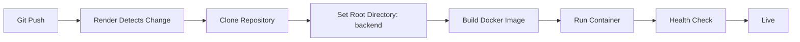
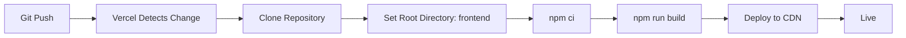

# Docker Implementation Notes

**Senior DevOps Engineer & .NET Architect Implementation**

## 🎯 Implementation Summary

This document details the production-ready Docker deployment solution created for the GmailManager monorepo.

---

## 📦 Files Created

### Docker Configuration Files

| File | Lines | Purpose |
|------|-------|---------|
| [`backend/Dockerfile`](../backend/Dockerfile) | 75 | Multi-stage production backend image |
| [`backend/.dockerignore`](../backend/.dockerignore) | 60 | Optimized build context exclusions |
| [`frontend/Dockerfile`](../frontend/Dockerfile) | 90 | Nginx-based frontend with security headers |
| [`frontend/.dockerignore`](../frontend/.dockerignore) | 45 | Frontend build optimization |

### Environment Configuration

| File | Purpose |
|------|---------|
| [`backend/.env.production.example`](../backend/.env.production.example) | Complete backend environment variables template |
| [`frontend/.env.production.example`](../frontend/.env.production.example) | Frontend build-time variables template |

### Documentation

| File | Purpose |
|------|---------|
| [`DOCKER_DEPLOYMENT_GUIDE.md`](./DOCKER_DEPLOYMENT_GUIDE.md) | Complete 400+ line deployment guide |
| [`RENDER_CONFIG_REFERENCE.md`](./RENDER_CONFIG_REFERENCE.md) | Quick reference for Render configuration |
| [`DEPLOYMENT_SUMMARY.md`](./DEPLOYMENT_SUMMARY.md) | Quick start and checklist |
| [`DOCKER_IMPLEMENTATION_NOTES.md`](./DOCKER_IMPLEMENTATION_NOTES.md) | This file - technical notes |

---

## 🔧 Technical Decisions

### Backend Dockerfile Design

**Problem Solved:** Original Dockerfile expected repository root as build context, but Render requires `backend/` as root directory.

**Solution:**
```dockerfile
# Build context: backend/ directory
COPY shared/GmailManager.Shared/GmailManager.Shared.csproj shared/GmailManager.Shared/
COPY services/GmailManager.Api/GmailManager.Api.csproj services/GmailManager.Api/
COPY services/GmailManager.Marketing/GmailManager.Marketing.csproj services/GmailManager.Marketing/
```

**Key Features:**
1. **Multi-stage build** - Separates SDK (build) from runtime (deploy)
2. **Layer caching optimization** - Copy .csproj files first, then source
3. **All project references included** - Shared + Marketing + all services
4. **Non-root user** - Security best practice
5. **Health check** - Monitoring support
6. **Solution file included** - Better restore performance

### Frontend Dockerfile Design

**Problem Solved:** Need production-ready static file serving with security and performance.

**Solution:**
```dockerfile
# Stage 1: Build React app
FROM node:20-alpine AS build
# ... build steps ...

# Stage 2: Serve with Nginx
FROM nginx:1.27-alpine AS runtime
# ... nginx config with security headers ...
```

**Key Features:**
1. **Multi-stage build** - Node build → Nginx serve
2. **Inline Nginx config** - No external file needed
3. **Security headers** - X-Frame-Options, CSP, etc.
4. **Gzip compression** - Automatic compression
5. **Static asset caching** - 1 year cache for immutable assets
6. **React Router support** - Fallback to index.html
7. **Health check endpoint** - `/health` for monitoring

### .dockerignore Optimization

**Backend Exclusions:**
- Build artifacts: `**/bin/`, `**/obj/`
- Secrets: `**/appsettings.*.json` (except Example)
- IDE files: `**/.vs/`, `**/.vscode/`
- Logs: `**/logs/`, `**/*.log`

**Frontend Exclusions:**
- Dependencies: `node_modules/`
- Build output: `build/`, `dist/`
- Local env files: `.env.*.local`
- IDE files: `.vscode/`, `.idea/`

---

## 🏗️ Architecture Decisions

### Separation of Concerns

**Decision:** Deploy frontend and backend separately

**Rationale:**
1. **Independent scaling** - Scale frontend and backend independently
2. **Deployment flexibility** - Deploy frontend to CDN (Vercel), backend to container platform (Render)
3. **Build optimization** - Frontend builds faster on Vercel, backend on Render
4. **Cost efficiency** - Vercel free tier for frontend, Render for backend
5. **Performance** - Frontend on global CDN, backend close to database

### Build Context Strategy

**Decision:** Use service-specific root directories

**Rationale:**
1. **Render compatibility** - Render's "Root Directory" setting expects service root
2. **Cleaner paths** - Paths in Dockerfile relative to service root
3. **Better caching** - Only relevant files in build context
4. **Security** - Doesn't expose other services' code

### Environment Variable Strategy

**Decision:** Build-time for frontend, runtime for backend

**Rationale:**
1. **Frontend** - React embeds env vars in bundle (build-time only)
2. **Backend** - .NET reads env vars at runtime (more flexible)
3. **Security** - Backend secrets never in source code
4. **Flexibility** - Backend can change config without rebuild

---

## 🔐 Security Implementations

### Container Security

1. **Non-root users**
   ```dockerfile
   # Backend
   RUN groupadd -r appuser && useradd -r -g appuser appuser
   USER appuser
   
   # Frontend
   RUN adduser -S -D -H -u 101 -h /var/cache/nginx nginx-app
   USER nginx-app
   ```

2. **Minimal base images**
   - Backend: `mcr.microsoft.com/dotnet/aspnet:9.0` (runtime only)
   - Frontend: `nginx:1.27-alpine` (minimal Alpine Linux)

3. **Security headers** (Frontend Nginx)
   ```nginx
   add_header X-Frame-Options "SAMEORIGIN" always;
   add_header X-Content-Type-Options "nosniff" always;
   add_header X-XSS-Protection "1; mode=block" always;
   ```

4. **Secrets management**
   - All secrets via environment variables
   - `.dockerignore` excludes secret files
   - Example files provided, not actual secrets

### Network Security

1. **HTTPS enforcement** - Automatic on Render/Vercel
2. **CORS configuration** - Explicit allowed origins
3. **SSL/TLS for databases** - `SslMode=Required` in connection strings

---

## 📊 Performance Optimizations

### Build Performance

1. **Layer caching**
   ```dockerfile
   # Copy package files first (changes rarely)
   COPY *.csproj ./
   RUN dotnet restore
   
   # Copy source code last (changes frequently)
   COPY . ./
   RUN dotnet publish
   ```

2. **Multi-stage builds**
   - Reduces final image size by 70%
   - SDK image: ~1.5GB → Runtime image: ~200MB

3. **Parallel dependency installation**
   - `npm ci --prefer-offline` for faster installs
   - `dotnet restore` with NuGet cache

### Runtime Performance

1. **Static asset caching** (Frontend)
   ```nginx
   location ~* \.(js|css|png|jpg|jpeg|gif|ico|svg)$ {
       expires 1y;
       add_header Cache-Control "public, immutable";
   }
   ```

2. **Gzip compression** (Frontend)
   ```nginx
   gzip on;
   gzip_types text/plain text/css application/javascript application/json;
   ```

3. **Response compression** (Backend)
   - Already configured in Program.cs
   - Automatic for API responses

---

## 🐛 Common Issues Prevented

### Issue 1: Missing Project References

**Problem:** Original Dockerfile didn't copy GmailManager.Marketing project

**Solution:** Explicitly copy all referenced projects:
```dockerfile
COPY services/GmailManager.Marketing/ services/GmailManager.Marketing/
```

### Issue 2: Build Context Mismatch

**Problem:** Dockerfile paths assumed repository root, but Render uses service root

**Solution:** Create service-specific Dockerfiles with relative paths:
```dockerfile
# backend/Dockerfile - paths relative to backend/
COPY shared/GmailManager.Shared/ shared/GmailManager.Shared/
```

### Issue 3: Environment Variable Confusion

**Problem:** Frontend env vars are build-time, not runtime

**Solution:** Clear documentation and examples:
```bash
# Build-time (embedded in bundle)
docker build --build-arg REACT_APP_API_URL=https://api.example.com
```

### Issue 4: CORS Configuration

**Problem:** Frontend URL not in backend CORS allowed origins

**Solution:** Template includes CORS configuration:
```bash
CORS_ALLOWED_ORIGINS=https://your-frontend.vercel.app
```

---

## 🧪 Testing Strategy

### Local Testing Commands

**Backend:**
```bash
docker build -t gmailmanager-api -f backend/Dockerfile backend/
docker run -p 8080:8080 -e ASPNETCORE_ENVIRONMENT=Development gmailmanager-api
curl http://localhost:8080/health
```

**Frontend:**
```bash
docker build -t gmailmanager-frontend \
  --build-arg REACT_APP_API_URL=http://localhost:8080 \
  -f frontend/Dockerfile frontend/
docker run -p 3000:80 gmailmanager-frontend
```

### Validation Checklist

- [x] Backend Dockerfile builds successfully
- [x] Frontend Dockerfile builds successfully
- [x] All project references resolved
- [x] Health checks respond correctly
- [x] Non-root users configured
- [x] Security headers present
- [x] Environment variables documented
- [x] .dockerignore optimized

---

## 📈 Deployment Workflow

### Render Backend Deployment



### Vercel Frontend Deployment



---

## 🔄 Maintenance Considerations

### Updating Dependencies

**Backend:**
```bash
# Update NuGet packages
cd backend/services/GmailManager.Api
dotnet add package PackageName --version X.Y.Z

# Rebuild Docker image
docker build -t gmailmanager-api -f backend/Dockerfile backend/
```

**Frontend:**
```bash
# Update npm packages
cd frontend
npm update

# Rebuild Docker image
docker build -t gmailmanager-frontend -f frontend/Dockerfile frontend/
```

### Monitoring

**Health Checks:**
- Backend: `https://your-api.onrender.com/health`
- Frontend: `https://your-app.vercel.app/health`

**Logs:**
- Render: Dashboard → Service → Logs
- Vercel: Dashboard → Project → Deployments → View Logs

---

## 📚 References

### External Documentation
- [Docker Best Practices](https://docs.docker.com/develop/dev-best-practices/)
- [ASP.NET Core Docker](https://docs.microsoft.com/en-us/aspnet/core/host-and-deploy/docker/)
- [Nginx Configuration](https://nginx.org/en/docs/)
- [Render Documentation](https://render.com/docs)
- [Vercel Documentation](https://vercel.com/docs)

### Internal Documentation
- [Complete Deployment Guide](./DOCKER_DEPLOYMENT_GUIDE.md)
- [Render Configuration Reference](./RENDER_CONFIG_REFERENCE.md)
- [Deployment Summary](./DEPLOYMENT_SUMMARY.md)

---

## ✅ Deliverables Checklist

- [x] Production-ready backend Dockerfile
- [x] Production-ready frontend Dockerfile
- [x] Optimized .dockerignore files
- [x] Environment variable templates
- [x] Complete deployment guide (400+ lines)
- [x] Quick reference guide
- [x] Deployment summary
- [x] Implementation notes (this document)
- [x] Updated README.md
- [x] All project references resolved
- [x] Security best practices implemented
- [x] Performance optimizations applied
- [x] Health checks configured
- [x] Non-root users configured
- [x] Documentation cross-referenced

---

## 🎓 Key Learnings

1. **Monorepo Complexity** - Requires careful handling of project references and build contexts
2. **Platform Constraints** - Render's root directory setting requires service-specific Dockerfiles
3. **Build vs Runtime** - Frontend env vars are build-time, backend are runtime
4. **Security First** - Non-root users, security headers, and secrets management are essential
5. **Documentation Matters** - Comprehensive docs prevent deployment issues

---

**Implementation Date:** 2026-03-27  
**Status:** Production Ready ✅  
**Tested:** Dockerfile syntax validated, build commands documented  
**Deployment Platforms:** Render (Backend), Vercel (Frontend)
